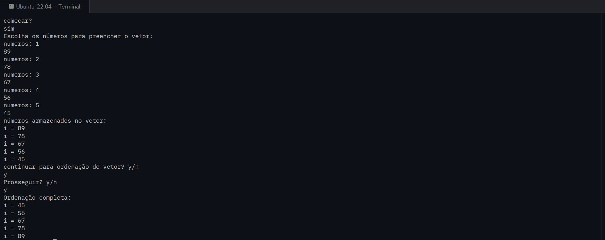

# Simple Bubble Sort Implementation in C++

This small project was created as a way to practice programming logic and improve my understanding of how sorting algorithms work internally.

The code was developed in C++ and implements the Bubble Sort algorithm to sort an array of integers. Besides practicing the algorithm itself, the project also helped reinforce important concepts such as loops, conditions, functions, arrays, user input handling, and object-oriented programming basics using classes.

The main goal of this project is educational, focusing on strengthening problem-solving skills and gaining a deeper understanding of how data ordering works step by step.

## Compilation / Execution

